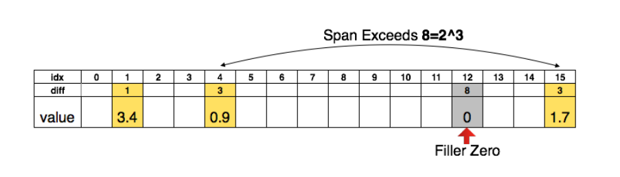
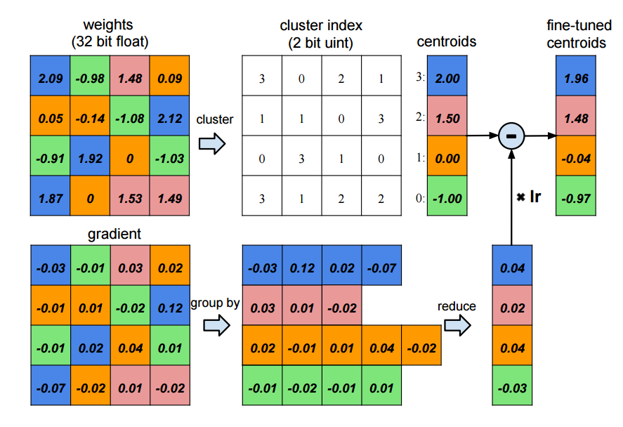
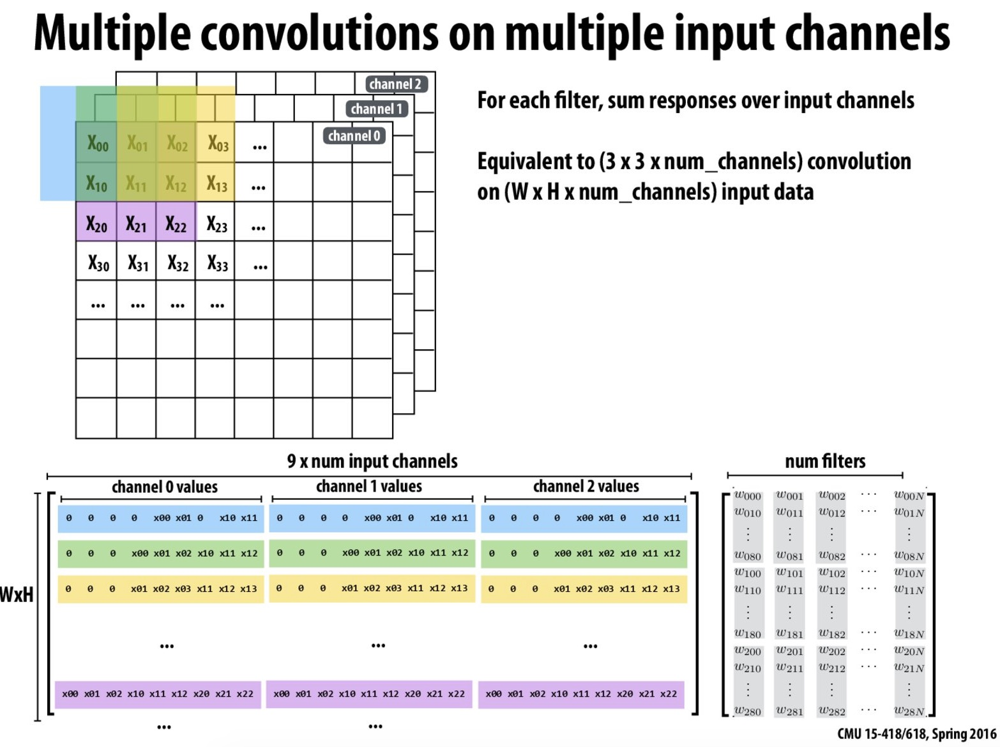
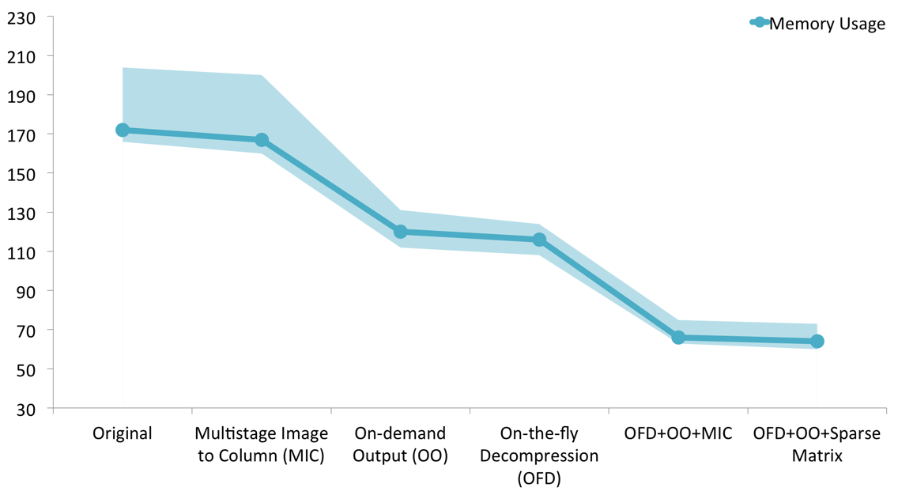
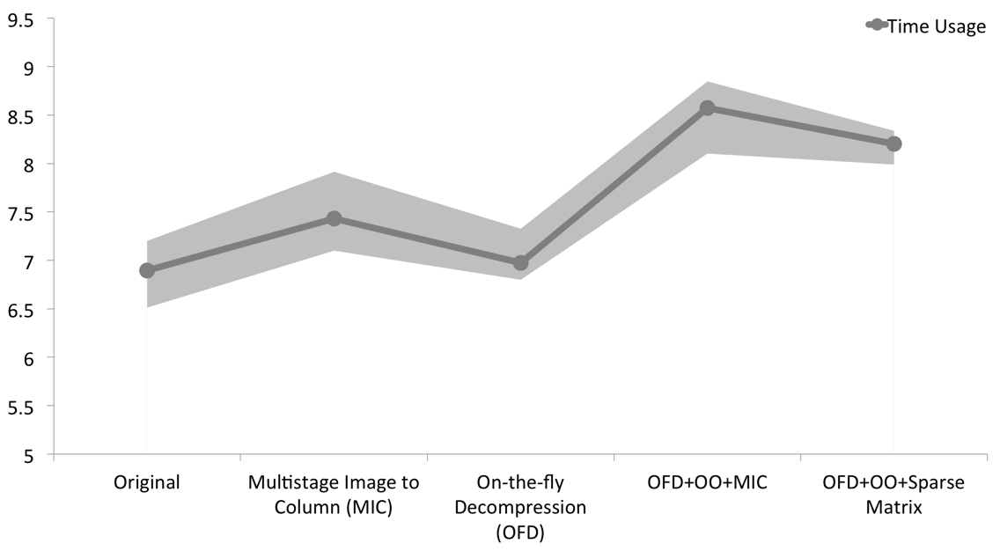
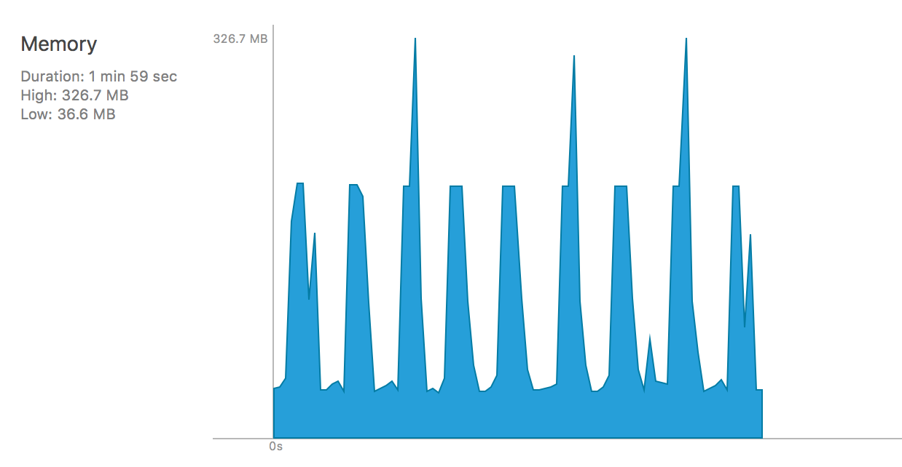
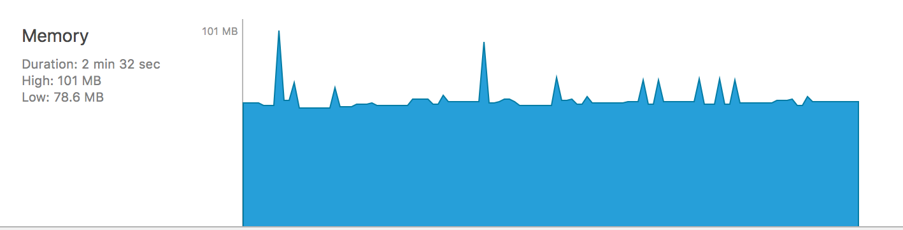
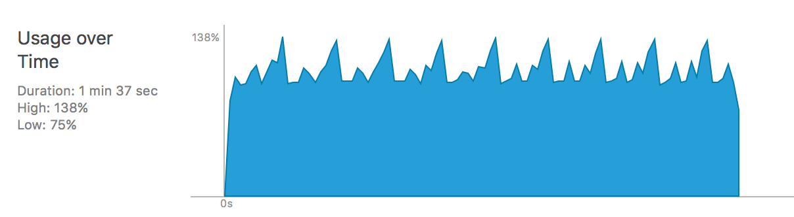
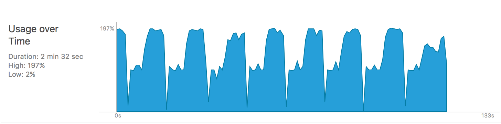

<style>sup:before { content: "["; }sup:after { content: "]"; }</style>

<a href="https://github.com/codinfox/espresso" title="Fork me on Github" class="github-corner"><svg width="80" height="80" viewBox="0 0 250 250" style="fill:#151513; color:#fff; position: fixed; top: 0; border: 0; right: 0;"><path d="M0,0 L115,115 L130,115 L142,142 L250,250 L250,0 Z"></path><path d="M128.3,109.0 C113.8,99.7 119.0,89.6 119.0,89.6 C122.0,82.7 120.5,78.6 120.5,78.6 C119.2,72.0 123.4,76.3 123.4,76.3 C127.3,80.9 125.5,87.3 125.5,87.3 C122.9,97.6 130.6,101.9 134.4,103.2" fill="currentColor" style="transform-origin: 130px 106px;" class="octo-arm"></path><path d="M115.0,115.0 C114.9,115.1 118.7,116.5 119.8,115.4 L133.7,101.6 C136.9,99.2 139.9,98.4 142.2,98.6 C133.8,88.0 127.5,74.4 143.8,58.0 C148.5,53.4 154.0,51.2 159.7,51.0 C160.3,49.4 163.2,43.6 171.4,40.1 C171.4,40.1 176.1,42.5 178.8,56.2 C183.1,58.6 187.2,61.8 190.9,65.4 C194.5,69.0 197.7,73.2 200.1,77.6 C213.8,80.2 216.3,84.9 216.3,84.9 C212.7,93.1 206.9,96.0 205.4,96.6 C205.1,102.4 203.0,107.8 198.3,112.5 C181.9,128.9 168.3,122.5 157.7,114.1 C157.9,116.9 156.7,120.9 152.7,124.9 L141.0,136.5 C139.8,137.7 141.6,141.9 141.8,141.8 Z" fill="currentColor" class="octo-body"></path></svg></a><style>.github-corner:hover .octo-arm{animation:octocat-wave 560ms ease-in-out}@keyframes octocat-wave{0%,100%{transform:rotate(0)}20%,60%{transform:rotate(-25deg)}40%,80%{transform:rotate(10deg)}}@media (max-width:500px){.github-corner:hover .octo-arm{animation:none}.github-corner .octo-arm{animation:octocat-wave 560ms ease-in-out}}tr:nth-child(even) {background: #eee}tr:nth-child(odd) {background: #fff}</style>

# Espresso <i class="fa fa-coffee"></i>

## A minimal high performance parallel neural network framework running on iOS

**[Zhihao Li](http://codinfox.github.io/)** (zhihaol) and **[Zhenrui Zhang](http://jerryzh168.github.io/)** (zhenruiz)

<style>a.nav { color: #585858; border-radius: 5px; background: #E6E6E6; padding: .2em .7em; text-decoration: none; margin: .5em .5em; display:inline-block; }a.nav:hover { background: #D8D8D8; color: black;}a.nav.selected { background: #D8D8D8; font-weight: bold; }small{color: #5e5e5e; display:block;text-align:center;margin-bottom: 1em;}</style>
<div style="text-align: center;"><a class="nav selected" href="http://codinfox.github.io/espresso/proposal" target="_blank">Final Report</a> <a class="nav" href="http://codinfox.github.io/espresso/proposal" target="_blank">Proposal</a> <a class="nav"  href="http://codinfox.github.io/espresso/checkpoint" target="_blank">Checkpoint Report</a></div>

<blockquote style="margin-top:2em;">
<p><date style="display:block;font-weight:bold;"><i class="fa fa-exclamation-circle" aria-hidden="true"></i> Updated 2016.05.09 12:00 EST</date> Our project won 1st prize in 2016 CMU Annual Parallel Competition! <a href="http://15418.courses.cs.cmu.edu/spring2016/competition">See details here</a>.</p>
</blockquote>

### Overview

We developed a parallel neural network framework running well on iOS devices despite of the limited memory and computing resources. Our framework features low memory footprint and high parallelism. By extensively using **CPU SIMD operations**, **GPU acceleration**, **on-demand output**, **on-the-fly network decompression**, **sparse matrix operations** and many other techniques, one can evaluate networks as deep as 60+ layers or as large as AlexNet[^9] with ease.

With above mentioned techniques, we are able to **shrink the peak memory usage to 35% of original network**, and get **>250x speedup over our naive implementation** (also the implementation used by [other neural network framework in iOS](https://github.com/alexsosn/ConvNetSwift.git)). Beside those numbers, our framework is also well designed and easy to use.

<div style="text-align: center;"><iframe width="560" height="315" src="https://www.youtube.com/embed/uBqwVKA_SZQ" frameborder="0" allowfullscreen></iframe></div>

### Background

According to Morgan Stanley Research, as of the year of 2011, half of the computing devices worldwide are mobile devices [^6]. The intelligent mobile applications are changing people's lives. However after a quite thorough survey, we find no fully functional deep neural network framework on iOS. Therefore, we want to implement our own.

This framework features ***well designed and easy to use API***, and ***high performance parallel neural network implementation*** based on Accelerate framework and Metal.

With such framework, software engineers can easily deploy network on their iOS devices. This can potentially lead to many interesting applications. For example, an application that can recognize daily objects ***in almost real time without connection to internet***. We envision a great future market opening for such framework.

However, the task of training and running neural networks on a iOS device is challenging.

* **Memory Limitation** The latest version of iPhone (iPhone 6S) has only 2 GB RAM. This makes running a network on such device very difficult, not to mention training on it. To compensate this issue, we may take advantage of recent research outgrowth on compression of deep neural networks [^1] [^2] [^3] [^8].
* **High Performance Computing** Parallelizing a neural network implementation on iOS devices is an unprecedented task. We will explore the possibility of Metal API to implement a GPGPU version of the framework and Accelerate framework for CPU version.

Baring these challenges, in this project, we attempt to solve these issues and make a usable framework.

### Our Approach

#### Addressing Memory Constraint

Most networks contain millions of weights, making them super large and infeasible to be run on mobile devices. 

##### Deep Compression


<small>Representing the matrix sparsity with relative index</small>


<small>Weight sharing by scalar quntization and centroids fine-tuning</small>

Besides normal full-sized networks, our framework also supports networks compressed with deep compression algorithm [^2]. By using pruning, trained quntization, deep compression algorithm can compress AlexNet from 240M to only 8M. This significantly reduces the amount of data we need read into memory. The method is shown in the above 2 figures.

##### On-the-fly Decompression

If we decompress the whole compressed network, then the problem degrade back to the big network problem - the weights still cannot fit into memory. Therefore, we decompress the weights on the fly: when the memory is sufficient for containing the whole network, then all the weights are stored in the network; if the memory is limited, then the weights are decompressed only when it is needed. With this strategy, we manage to fit the whole AlexNet (240M+ weights, >0.5GB runtime memory usage without compression)

##### On-demand Outputs 

Not all the outputs are needed all the time. Therefore, we only keep outputs when they are needed in the network architecture. Otherwise, we purge the memory of the outputs. This is import to DAG network architectures. In case of training (which we don't currently support yet), we can save the outputs to flash disk. This is a performance-memory usage trade off.

##### Sparse Matrix Represent and Operations

We represent matrix whenever possible if the memory is limited (as the compressed network is represented as sparse matrix). After decompression, we recover the COO (Coordinate list) representation of the sparse matrix. **We developed sparse-dense matrix multiplication operations**. Therefore, we can evaluate the network without converting it to dense matrix form.

##### Multistage Image to Column

We used to implement the multistage image to column. However, since we are able to do sparse matrix operations now, we no longer use such strategy. For details see next section.

#### Performance Optimizations

Neural networks are inherently parallelizable within layer, as there is little dependency inside a layer. Also, there is great localities in most of the layers. We tried our best to leverage all the localities and SIMD/multithreading opportunities.

##### The problem of efficiently evaluating neural networks
In a typical neural network, the most expensive layers are Convolution layer and Fully Connected Layer. 
Convolutions layer is compute bound, and a naive implementation requires 7 for loops. Data parallelism is commonly applied in convolution layer, that is, we distribute the input data of convolution layer in different machines, using parallelism to speedup the computation, while replicate the model(weights) in different machines.
Fully connected layers has far more weights than other layers, so model parallelism is adopted in this case. The model are splitted in different machines while the input data are kept the same.
However, we don't have the luxury of parallelising over multiple machines, multiple GPUs or even multiple CPUs(The most recent iPhone model has 2 CPU cores). In such a constrined environment, what we can use as a building block is the SIMD operations in CPU, accessed through the highly optimized Accelerate Framework, and the quad-core GPU, available to use throught the Metal APIs.
Also, in such a limited time, we want to choose which layers to optimize very carefully. Based on usage patterns and the impact on performance, we decided to make the most effort in optimizing Convolution layer since it's computationally expensive and most commonly used.

##### Image to Column(`im2col`) in Convolution Layer



In our naive implementation, we used the common 7 for loops to implement convolution layer to keep the memory usage low. Also there is no parallelism at all in the naive implementation since it is doesn't use the SIMD features of CPU or the GPU parallelism. It turns out that the performance suffers a lot without `im2col` and parallelsim. The original implementation takes about 1800 seconds to evaluate a `SqueezeNet`, while the version using `im2col` and Accelerate framework for matrix multiplication takes only 7 seconds, yielding a ~250x speedup. 

The speedup can be attributed to both our efficient implementation of `im2col` function, which restructures the computation as matrix multiplication and the highly optimized matrix operations in Accelerate framework.

Our implementation of `im2col` fully utilized the spacial locality in the operation. The `im2col` operation expands the image to multiple small vectors, each vector corresponds to the values of the image pixels when the convolution is performed. The above figure is a slide from 15-418/618 course website. There is not much spacial locality to exploit in each row, since the kernelSize is typically small (3 is a common choice). However, if we look at the column of the result matrix, the ajacent pixels in result matrix are the pixels with the same index in the kernel window for ajacent convolution operations, which are almost consequtive in the original image matrix, or ajacent if the stride is 1. Therefore, if we fill the matrix column by column, we'll have great spacial locality in reading the original matrix. To further improve the locality of the output matrix, we will produce a matrix that is a transpose of the matrix shown in the slide instead. This way, we can have the best spatial locality both in input matrix and in output matrix.

##### Multi-stage Image to Column

 `im2col` introduces memory overhead since the original image is inflated by a factor of (numInputChannels * kernelSize ^ 2). We don't want this optimization to negatively affect the memory efficiency, since memory efficiency is what enables us to run networks that can not be run in mobile devices before. According to the algorithm, the result of `im2col` only depend on the original image and the kernel size, and there is no dependency between different input channels. The intermediate result can be consumed immediately by summing into the output matrix. Therefore, we can reduce the memory usage by a factor of (numInputChannels) in memory constraint situations.
 
##### GPU Parallel Implementation of Layers

We reimplemented all the layers on Apple GPU with Metal API. Metal is an API similar to OpenCL than can be used to exploit the parallelism over the GPU cores on iOS devices. Our straightforward implementation achieved a better performance than the optimized CPU version, which we believe, is a result of the increased parallelism in multiple GPU threads(warps). Also, in our GPU implementation, we distribute the work 

Inspired by the speedup of `im2col` in the CPU version, we also implemented the GPU version of `im2col` and a naive matrix multiplication implementation. The performance is similar to the most straightforward GPU implementation. One reason could be that the naive matrix multiplication doesn't make up for the extra overhead of doing `im2col`. And the utilization of parallelism is already sufficient in the original implementation. Because of the time limit, we didn't further explore in this direction, we leave the further optimization of GPU version as a place for future improvment.
 
##### Other optimizations using Accelerate Framework

The accelerate framework is our interface to access the SIMD feature provided in Swift, to fully utilize the feature, we also apply the APIs in accelerate framework when appropriate(specifically, use matrix multiplications instead of for loops).

### Current Result

#### Network Architectures

We performed analysis on three differnet architectures:

| Name | Dataset | #parameters | #layers | #conv/fc layers | Original Runtime Memory |
|:---:|:---:|:---:|:---:|:---:|:---:|
| LeNet | MNIST | <1M | 9 | 4 | 42.6M |
| SqueezeNet | ImageNet | 1.2M | 66 | 26 | 172M |
| AlexNet | ImageNet | 61M | 23 | 8 | >0.5G |

In all experiments, we use batch size of 1.

#### Memory Usage

Memory usage experiments are done on CPU version only. Many of these memory optimizations are currently not ported to GPU version, and we don't currently know how to measure GPU performances on iOS devices.


<small>Memory usage with different techniques. The experiment is done with SqueezeNet [^8]. The band shows the maximum and minimum memory usage and the solid line shows the average memory usage. The runtime memory usage of original network is 172M, while after applying all the techniques, we manage to shrink it to 66M</small>

We performed analysis on the SqueezeNet. The result comes from 10 repeated trails. We can see that after applying OFD, MIC and OO, we are able to shrink the peak memory usage to around 66M, while applying OFD, OO and Sparse Matrix can also reduce the peak memory usage to slightly lower than 66M. 

The difference between OFD+OO+Sparse Matrix and OFD+OO+MIC is the performance impact. A trade-off needs to be made in the performance. Since we spend some time on optimizing for memory usage, the performance suffers a little due to the addtional memory operations.


<small>Memory usage with different techniques. The experiment is done with SqueezeNet [^8]. The band shows the maximum and minimum time usage and the solid line shows the average time usage. It shows the time taken for one forward through the whole network. Result is got from 10 repeated trails.</small>

As expected, the performance degrade slightly. It takes 1 more second to finish one forward pass in the SqueezeNet with OFD+OO+Sparse Matrix. This degrade in performance is acceptable.

We observe that OFD+OO+MIC, although achieved almost equally low peak memory  usuage, OFD+OO+Sparse Matrix is better performance-wise. This is because by using sparse matrix representation and operations, we can reduce the number of operations performed by the algorithm.

We also did a run time memory recording on the AlexNet.


<small>Runtime memory analysis on AlexNet with OFD+OO+MIC</small>

With OFD+OO+MIC, the memory usage bumps a lot. The peaks are when the network runs to the fully connected part. Since fully connected layers in AlexNet contributes almost 90% weights, doing MIC can still result in a huge amount of weight to be recovered (since MIC is not applicable to fully connected layers).


<small>Runtime memory analysis on AlexNet with OFD+OO+Sparse Matrix</small>

We see when sparse matrix is applied, the peak memory usage is reduced to 101M, which is 3x less than OFD+OO+MIC version. This is mainly due to the sparse representation of weights of fully connected layers. Because weights of fully connected layers are aggresively compressed by deep compression algorithm, by not converting the sparse form to dense form, we save a lot of memory and operations.

#### Performance

The following table is the running time of evaluting 3 networks in our framework.

|   Network   | Naive | Optimized | GPU Version |
|:---------:|:-------------------:|:-----:|:-------:|
| `SqueezeNet`(31M) |~1800s| 7.8s (230x) | ~5s (360x) |
| `AlexNet` (233M) | / |  6.9s | / |
|`MNIST`(11M)| / |0.024s | / |

Although `AlexNet` has much more parameters (240M model file) than `SqueezeNet`(30M model file), the evaluation time is still less than `SqueezeNet`, one difference between the two network is that `SqueezeNet` has a lot more layers than `AlexNet`, which means the inherent sequential part of the computation is potentially larger since our implementation enforces strict dependencies between layers(The layers are topologically sorted according to dependency in construction time). The same argument applies for the running time of `MNIST` since it has far shallower networks.

Another reason that `AlexNet` is faster is that the sparse matrix multiplication. In `SqueezeNet`, the weights are very dense, so there is little benefit in applying the sparse matrix multiplication. While in `AlexNet`, the weights are much larger and more sparse, and the benefit of sparse matrix multiplication is taking effect.


<small>Runtime CPU Usage analysis on SqueezeNet on iPhone 6 (2 cores)</small>


<small>Runtime CPU Usage analysis on AlexNet on iPhone 6 (2 cores)</small>


One thing we find interesting is that when running on a 2 core iPhone 6, the CPU usage patterns are quite different between SuqeezeNet and AlexNet, as shown in the above figures. The CPU usage in SqueezeNet can only reach 138% while it can reach 198% in AlexNet. This is mainly due to the scale of the network weights. As there are more weights inside AlexNet, multithreading is more reasonable, while the benefit of multithreading in SqueezeNet does not make up for its overhead, as the weight matrix is of smaller scale in SqueezeNet.

We also observe that in AlexNet, in the later stage, the CPU usage reaches almost 200% while in the early stage it is around 100%, this is due to the evaluation of fully connected layer. As there are more weights in the fully connected layers, multithreading makes more sense.

### Deliverables 

In this project, we want to developed a Caffe-like deep neural network framework running on iOS/OSX devices, in both CPU and GPU, that provides usable primitives to

* Define a neural netowrk
* Read in a network
* Run compressed models
* Run normal models

To achieve this, we implemented

* `ImageData` layer
* `Convolution` layer
* `ReLU` layer
* `FullyConnected` layer
* `Softmax` layer: as output layer, no BP needed
* `Pooling` layer: max pooling, average pooling, global pooling
* `Concat` layer
* `LRN` layer

#### Code Example

An example of using our framework to define, import and evaluate the `SqueezeNet` is shown below.

```swift
     /* Our network support neural networks in
       Directed Acyclic Graph (DAG) structure */
    network = Network(parameters: 
                NetworkProperties(batchSize: 1, engine: .CPU))
    /* The image data layer
      user need to define a readImage function */
    network.add(ImageDataLayer(parameters: ImageDataParameters(
      name: "data",
      imgNames: Array<String>(count: 100, repeatedValue: ""),
      dimensions: [1,3,227,227],
      dependencies: [],
      readImage: { _ in (self.readUIImageToTensor().storage, [0])}
      )))
    /* Add a convolution layer with parameters and dependencies 
       on the last layer */
    network.add(ConvolutionLayer(parameters: ConvolutionParameters(
      name: "conv1",
      dependencies: ["data"],
      numOutput: 96,
      kernelSize: 7,
      stride: 2
      )))
    ...
    /* Add a max pooling layer with dependency on the last layer */
    network.add(PoolingLayer(parameters: PoolingParameters(
      name: "pool1",
      dependencies: ["relu_conv1"],
      kernelSize: 3,
      stride: 2,
      method: .MAX
      )))
    ...
    /* Softmax layer */
    network.add(SoftmaxLayer(parameters: SoftmaxParameters(
      name: "prob",
      dependencies: ["pool10"]
      )))

    /* Import model */
    self.network.importFromFile(filename)

    /* Evaluating the network */
    let out = self.network.forward().storage

    let prob = out.maxElement()
    /* The index of the label with largest probability */
    let index = out.indexOf(prob!)
```
### Acknowledgement

We would like to thank Prof. Kayvon for providing iOS developer certificate.

### Work division
Equal work was performed by both project members.

##### References:

[^1]: Kim, Yong-Deok, et al. "Compression of Deep Convolutional Neural Networks for Fast and Low Power Mobile Applications." *arXiv preprint arXiv:1511.06530* (2015).

[^2]: Han, Song, Huizi Mao, and William J. Dally. "A deep neural network compression pipeline: Pruning, quantization, huffman encoding." *arXiv preprint arXiv:1510.00149* (2015).

[^3]: Chen, Wenlin, et al. "Compressing neural networks with the hashing trick." *arXiv preprint arXiv:1504.04788* (2015).

[^4]: Courbariaux, Matthieu, Yoshua Bengio, and Jean-Pierre David. "Low precision arithmetic for deep learning." *arXiv preprint arXiv:1412.7024* (2014).

[^5]: Gupta, Suyog, et al. "Deep learning with limited numerical precision." *arXiv preprint arXiv:1502.02551* (2015).

[^6]: Huberty, K., Lipacis, C. M., Holt, A., Gelblum, E., Devitt, S., Swinburne, B., ... & Chen, G. (2011). Tablet Demand and Disruption. *Tablet*.

[^7]: Jia, Yangqing, et al. "Caffe: Convolutional architecture for fast feature embedding." *Proceedings of the ACM International Conference on Multimedia. ACM*, 2014.

[^8]: Iandola, Forrest N., et al. "SqueezeNet: AlexNet-level accuracy with 50x fewer parameters and< 1MB model size." *arXiv preprint arXiv:1602.07360* (2016).

[^9]: Krizhevsky, Alex, Ilya Sutskever, and Geoffrey E. Hinton. "Imagenet classification with deep convolutional neural networks." *Advances in neural information processing systems*. 2012.
